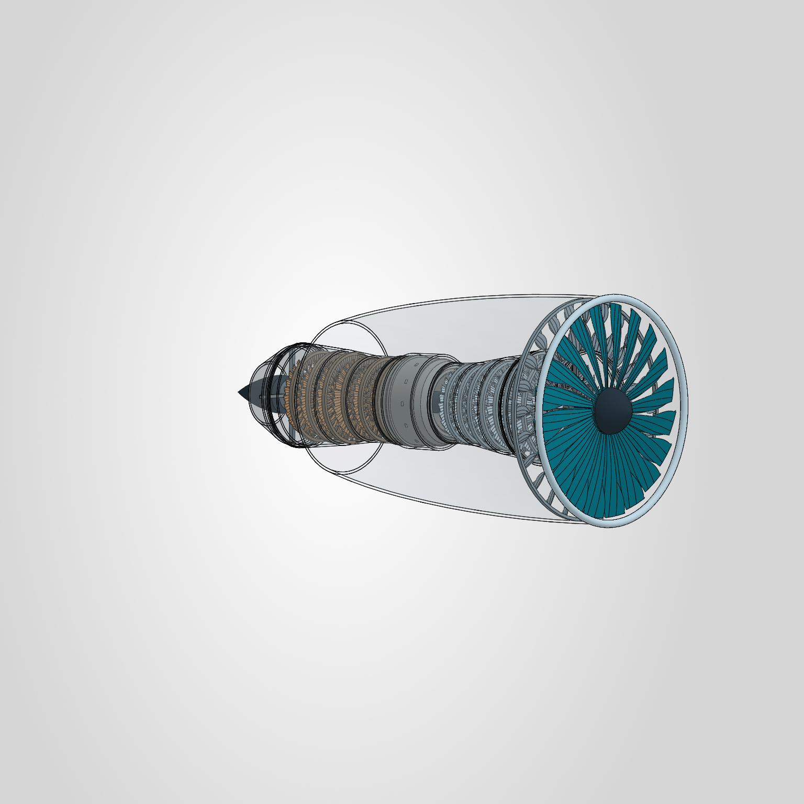

# Examples

Run these scripts from the repository root after completing the
[installation](../README.md#installation). They require live SOLIDWORKS with
the Dahlia add-in. Run one at a time.

## Quickstart

```powershell
uv run python examples/quickstart.py
```

Creates a 24 mm diameter spacer with a 10 mm bore and 8 mm thickness.
Each run gets a unique directory under `outputs/quickstart/` containing a
native `.SLDPRT`, a `.step`, and a `.png`. The part remains open for inspection.

## Turbofan



```powershell
uv run python examples/turbofan_demo.py
```

Builds an editable turbofan with a swept intake fan, two booster rows, six
high-pressure compressor rows, an annular combustor, two high-pressure turbine
rows, four low-pressure turbine rows, and interleaved stationary guide vanes.
Its intact housings are transparent; views use Shaded with Edges.

The default assembly contains 38 component instances and 39 standard mates.
Its 29 blade rows reuse 12 row designs, giving the compressor and turbine a
stepped taper and keeping construction time down. There are 21 unique parts.
Separate low-pressure and high-pressure shafts retain rotational freedom.
The script builds and saves the model, then leaves the finished assembly open.

Each run creates a new directory under `outputs/turbofan_demo/` with:

- The 21 native `.SLDPRT` dependencies.
- One `.SLDASM` assembly.

Keep the native assembly and its part files together. Both examples accept
`--output <directory>` to choose a different output parent directory.

The turbofan is a visual mechanical demonstration, without aerodynamic or
performance validation. Geometry, assembly, mates, and appearances
use Dahlia. A small direct COM step controls native display mode and camera.
